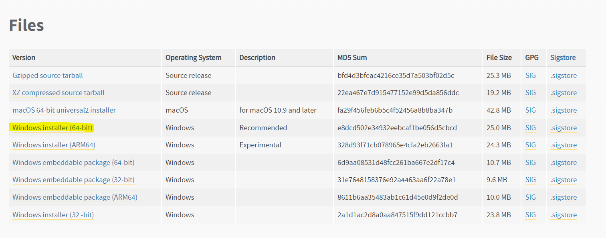
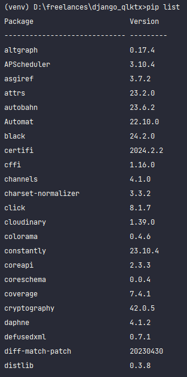
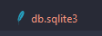
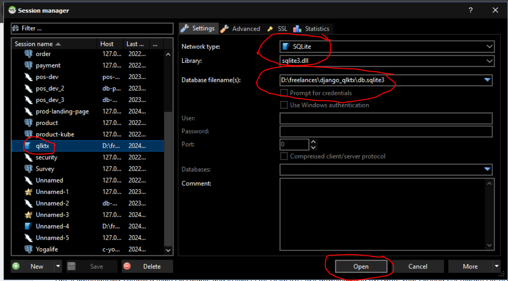
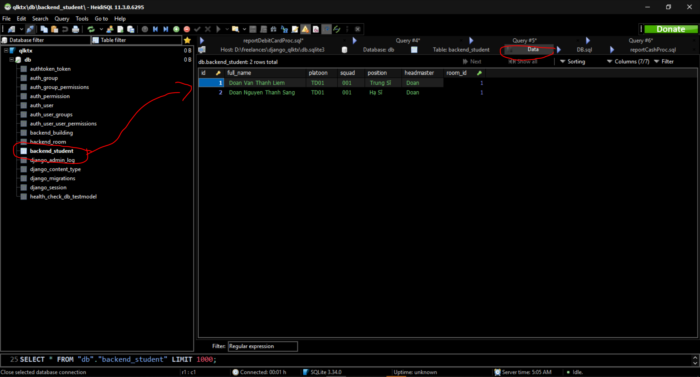
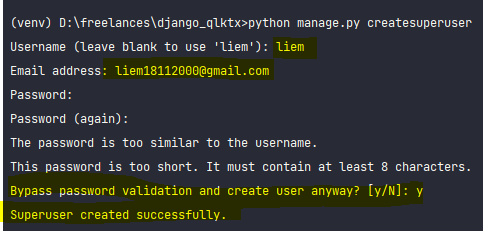
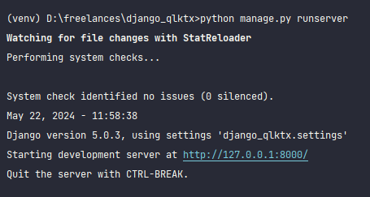
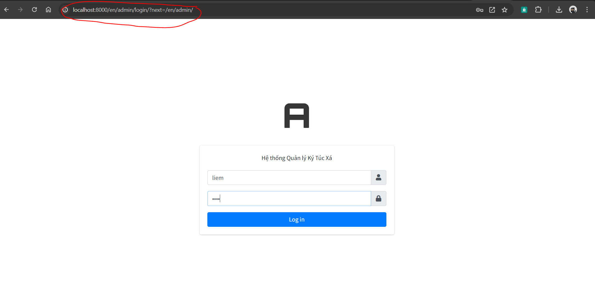
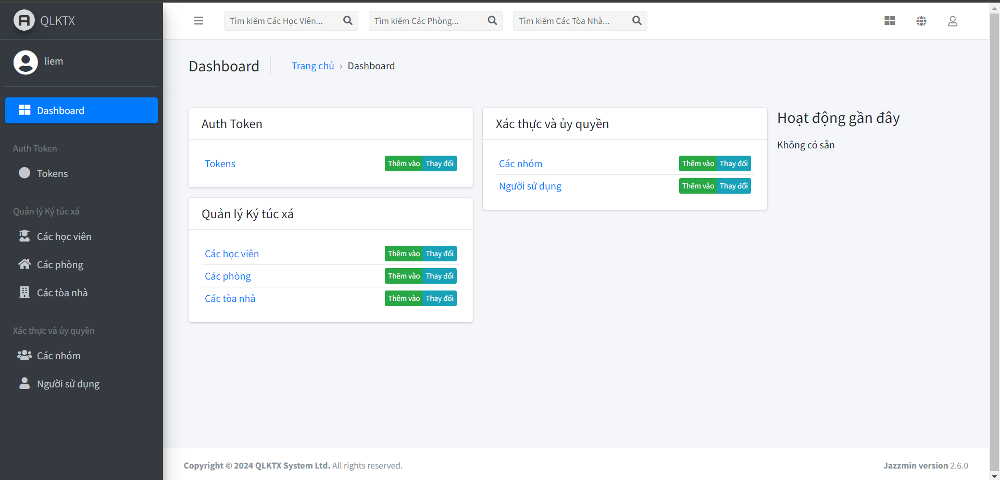

# QLKTX System

## Install Python 3.11



Link : https://www.python.org/ftp/python/3.11.9/python-3.11.9-amd64.exe

## Install PIP (if not have yet)

Check installation by:

```cmd
pip list
```

If terminal could show similar information, You do not need to install pip



If not, follow this guide : https://www.geeksforgeeks.org/how-to-install-pip-on-windows/

## Install all libraries

```cmd
pip install -r requirements.txt
```

## Migrate database
```cmd
python manage.py migrate
```

if you migrate done. you would see a file "de.sqlite3"



You can use this tool HeidySQL to view data in this file:
https://www.heidisql.com/installers/HeidiSQL_12.7.0.6850_Setup.exe





## Add admin user

```cmd
python manage.py createsuperuser
```



Note: Please remember your admin account. 
if you forget, create a new one with difference username and password

## Start application
```cmd
python manage.py runserver
```

The output of terminal would be similar to this:



## Login and usage

Goto browser and input: http://localhost:8000/admin

Login by account of admin



Login Success to enter dashboard:

